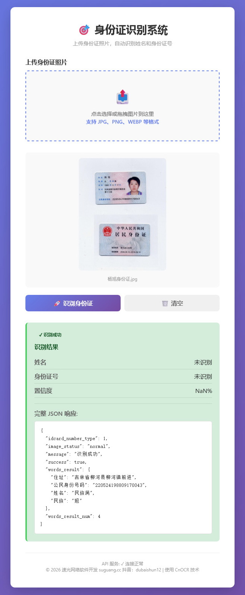

# 通用OCR API识别系统

一个基于CnOCR的通用文字识别系统，提供了 REST API 接口和网页前端。支持识别各类文档中的中文文本，通过正则表达式进行内容匹配和信息提取。

## 项目特性

- ✅ **高精度识别**：采用 CnOCR 最新的 `ch_PP-OCRv3` 模型，中文识别精度高
- ✅ **快速推理**：使用 ONNX 后端，推理速度快 2 倍以上
- ✅ **通用架构**：不仅限于身份证，可识别任何文本内容
- ✅ **易用的 API**：提供 RESTful API 接口，支持图片文件上传和 Base64 编码
- ✅ **网页界面**：提供友好的网页前端，支持拖拽上传
- ✅ **灵活的提取**：支持正则表达式匹配，可根据需求自定义信息提取规则
- ✅ **跨平台**：基于 Python，支持 Windows、Linux、macOS
- ✅ **相对路径**：使用相对路径配置，项目可在任何位置运行
- ✅ **可扩展**：易于基于本系统进行二次开发和定制

## 项目结构

```
cnocr-api-ocr/
├── cnocr/                          # CnOCR 核心库
│   ├── cn_ocr.py                   # 主识别类
│   ├── consts.py                   # 常量定义
│   ├── utils.py                    # 工具函数
│   ├── recognizer.py               # 识别器基类
│   ├── line_split.py               # 行切割模块
│   └── ppocr/                      # PaddleOCR 模块
│       ├── __init__.py
│       └── pp_recognizer.py
├── models/                         # 模型文件存放目录
│   └── ch_PP-OCRv3_rec_infer.onnx # OCR 识别模型
├── idcard_server_api.py            # 后端 API 服务
├── idcard_web.py                   # 前端网页服务
├── requirements.txt                # 项目依赖
└── README.md                       # 项目说明文档
```

## 使用场景

本系统适用于以下场景：

### 1. **身份证识别**（当前示例）
通过正则表达式识别：
- 18 位身份证号
- 姓名、性别、民族等基本信息
- 住址等长文本信息

### 2. **发票识别**
识别发票上的：
- 发票号码（正则匹配数字）
- 金额
- 日期等

### 3. **合同扫描**
提取合同中的：
- 合同号
- 甲乙方信息
- 金额条款等

### 4. **医疗单据**
识别病历、处方等文本内容

### 5. **其他文档**
任何需要从图片中提取文本的应用

**灵活扩展**：只需修改后端的正则表达式规则，即可适配不同的识别需求。

## 系统设计

系统分为三层：

```
┌─────────────────────────────────────┐
│   网页前端 (idcard_web.py)          │  ◄── 用户界面
│   - 拖拽上传                        │
│   - 实时预览                        │
└──────────────┬──────────────────────┘
               │ HTTP 请求
┌──────────────▼──────────────────────┐
│   API 服务 (idcard_server_api.py)   │  ◄── 业务逻辑
│   - 文件/Base64 接收                │
│   - OCR 识别调用                    │
│   - 正则表达式匹配                  │
│   - JSON 响应                       │
└──────────────┬──────────────────────┘
               │ 调用
┌──────────────▼──────────────────────┐
│   OCR 引擎 (CnOCR + ONNX)           │  ◄── 识别核心
│   - 文字检测                        │
│   - 文字识别                        │
│   - 返回原始识别结果                │
└─────────────────────────────────────┘
```

## 核心信息提取原理

系统通过正则表达式从 OCR 识别结果中提取信息：

```python
# 身份证号：18 位数字
id_pattern = re.compile(r'^\d{18}$')

# 姓名：2-4 个汉字
name_pattern = re.compile(r'^[\u4e00-\u9fa5]{2,4}$')

# 性别：男/女
gender_pattern = re.compile(r'^[男女]$')

# 出生日期：8 位数字
birth_pattern = re.compile(r'^\d{8}$')

# 住址：较长的中文文本
address_pattern = re.compile(r'[\u4e00-\u9fa5]{5,}')
```

**速光网络软件开发可定制**：根据不同的应用场景，修改或添加相应的正则规则。

## 精度与性能

## 安装

### 1. 克隆项目

```bash
git clone https://github.com/suguangnet/cnocr-api-ocr.git
cd cnocr-api-ocr
```

### 2. 安装依赖

```bash
pip install -r requirements.txt
```

如果遇到网络问题，可以使用国内镜像：

```bash
pip install -i https://mirrors.aliyun.com/pypi/simple/ -r requirements.txt
```

### 3. 准备模型

模型文件应放在 `models/` 目录下：

```
models/
└── ch_PP-OCRv3_rec_infer.onnx
```

如果没有模型文件，可以从以下渠道获取：
- [CnOCR 官方仓库](https://github.com/breezedeus/CnOCR)
- [PaddleOCR 模型库](https://github.com/PaddlePaddle/PaddleOCR)

## 使用方法

### 方式一：启动完整系统（API + 网页）

#### 启动后端 API 服务

```bash
python idcard_server_api.py
```

输出示例：
```
 * Running on http://127.0.0.1:5000
```

#### 启动前端网页服务（新终端）

```bash
python idcard_web.py
```

输出示例：
```
 * Running on http://127.0.0.1:3000
```

#### 访问网页界面

在浏览器中打开：**http://localhost:3000**

### 方式二：使用 API 调用

#### 文件上传方式

```bash
curl -X POST \
  -F "image=@/path/to/idcard.jpg" \
  http://localhost:5000/api/id_card/recognize
```

#### JSON 请求（Base64 编码）

```bash
curl -X POST \
  -H "Content-Type: application/json" \
  -d '{"image_base64": "...base64_encoded_image..."}' \
  http://localhost:5000/api/id_card/recognize
```

#### Python 调用示例

```python
import requests
from pathlib import Path

# 上传图片
with open('idcard.jpg', 'rb') as f:
    files = {'image': f}
    response = requests.post(
        'http://localhost:5000/api/id_card/recognize',
        files=files
    )

result = response.json()
print(result)
```

## 软件界面


## API 文档

### 识别接口

**POST** `/api/id_card/recognize`

#### 请求方式一：文件上传

**Content-Type**: `multipart/form-data`

| 参数 | 类型 | 必需 | 说明 |
|------|------|------|------|
| image | file | 是 | 身份证图片文件 |

#### 请求方式二：Base64 编码

**Content-Type**: `application/json`

```json
{
  "image_base64": "base64编码的图片数据"
}
```

#### 响应示例（成功）

```json
{
  "success": true,
  "words_result": {
    "姓名": "张三",
  },
  "words_result_num": 6,
  "image_status": "normal",
  "idcard_number_type": 1,
  "message": "识别成功"
}
```

#### 响应示例（失败）

```json
{
  "success": false,
  "words_result": {},
  "words_result_num": 0,
  "image_status": "normal",
  "message": "识别失败，未找到身份证号"
}
```

### 健康检查接口

**GET** `/api/id_card/health`

检查后端 API 服务状态。

## 身份证识别示例

系统可以识别身份证正面的以下信息：

| 字段 | 说明 |
|------|------|
| 姓名 | 身份证上的姓名 |
| 性别 | 男/女 |
| 民族 | 民族名称 |
| 出生 | 出生日期（YYYYMMDD 格式） |
| 住址 | 住址信息 |
| 公民身份号码 | 18 位身份证号 |

## 技术栈

- **OCR 引擎**：[CnOCR](https://github.com/breezedeus/CnOCR) v2.2+
- **模型格式**：ONNX（PaddleOCR v3）
- **推理框架**：onnxruntime
- **Web 框架**：Flask
- **深度学习**：PyTorch（模型依赖）
- **图像处理**：OpenCV、Pillow
- **开发环境**：Python 3.7+

## 依赖信息

详见 `requirements.txt`：

- `Flask==2.0.1` - Web 框架
- `torch==1.9.0` - 深度学习框架
- `torchvision==0.10.0` - 计算机视觉库
- `opencv-python==4.6.0.66` - 图像处理
- `cnstd==1.2` - 文字检测库
- `onnxruntime==1.11.1` - ONNX 推理引擎
- `Pillow>=9.0.0` - 图片处理

## 常见问题

### Q: 模型文件在哪里获取？

A: 可以从以下渠道获取：
- CnOCR 官方仓库的 releases 页面
- PaddleOCR 官方模型库
- 本项目的 models 目录应放置 `ch_PP-OCRv3_rec_infer.onnx` 文件

### Q: 如何改进识别准确度？

A: 
- 确保图片清晰、光线充足
- 调整模型参数（见 API 高级用法）
- 提供更多样本进行微调

### Q: 支持反面识别吗？

A: 当前版本只支持身份证正面识别。

### Q: 性能如何？

A: 单张身份证识别时间通常在 200-500ms（CPU 环境）。

## 许可证

本项目基于 CnOCR 库开发，遵循相应的开源协议。

## 致谢

- 感谢 [CnOCR](https://github.com/breezedeus/CnOCR) 提供的强大 OCR 能力
- 感谢 [PaddlePaddle](https://github.com/PaddlePaddle) 的优秀深度学习模型
- 感谢开源社区的支持

## 常见问题补充

### Q: 这个系统的精度如何？

A: 
- 在清晰、正常的图片上识别准确度可达 90%+
- 适合对准确度要求**不高**的场景
- 如需超高精度，建议结合人工审核或考虑商业方案

### Q: 可以用于生产环境吗？

A: 
- 可以，但建议配合人工审核机制
- 对于金融、医疗等高风险场景，建议谨慎使用
- 作为初步自动化处理+人工复核的方案是完全可行的

### Q: 如何识别其他类型的文档？

A: 修改 `extract_name_and_id()` 函数中的正则表达式规则，示例：

```python
# 识别发票
if re.match(r'^发票号\d{10}$', text):
    invoice_number = extract_digits(text)

# 识别金额
if re.match(r'^¥?\d+\.\d{2}$', text):
    amount = text
```

## 技术支持

如有问题，请提交 Issue 或 Pull Request。

---

**快速开始**：

```bash
# 安装依赖
pip install -r requirements.txt

# 启动 API（终端1）
python idcard_server_api.py

# 启动网页（终端2）
python idcard_web.py

# 访问 http://localhost:3000
```

## 技术支持

- **开发者：速光网络软件开发**
- 官网：suguang.cc
- 联系电话/微信：15120086569
- 抖音号：dubaishun12

## 版权信息

Copyright © 2025 速光网络软件开发. All rights reserved.

---
*关注我们的抖音账号获取最新更新和技术支持！*
